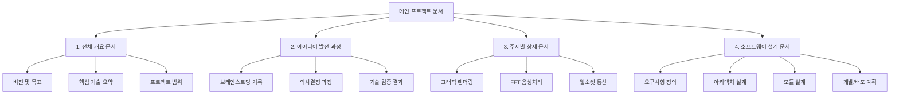

각 섹션별 작업 순서와 주요 고려사항을 정리해보겠습니다:

1. **메인 프로젝트 문서 작성**

   - 전체 프로젝트의 로드맵 수립
   - 각 섹션 간의 연관관계 정의
   - 문서 작성 일정 및 담당자 지정

2. **섹션별 세부 작업**

   A. **전체 개요 문서**

   - 이해관계자 인터뷰 진행
   - 시장 조사 및 경쟁사 분석
   - 프로젝트 KPI 설정

   B. **아이디어 발전 과정**

   - 회의록 및 토론 내용 정리
   - 기술 결정 사항 및 근거 문서화
   - 변경 이력 관리

   C. **주제별 상세 문서**

   1) 그래픽 렌더링
      - 성능 요구사항 상세화
      - 알고리즘 설계 문서
      - 최적화 전략 수립

   2) FFT 음성처리
      - 음성 품질 기준 정의
      - 실시간 처리 아키텍처 설계
      - 성능 테스트 계획

   3) 웹소켓 통신
      - 네트워크 아키텍처 설계
      - 보안 요구사항 정의
      - 확장성 계획 수립

   D. **소프트웨어 설계 문서**

   - 요구사항 명세서 작성
   - 시스템 아키텍처 설계
   - 상세 모듈 설계
   - CI/CD 파이프라인 구성

3. **검토 및 피드백 프로세스**

   - 내부 리뷰 진행
   - 외부 전문가 검토
   - 문서 수정 및 보완

4. **문서 관리 시스템 구축**

   - 버전 관리 체계 수립
   - 문서 접근 권한 설정
   - 변경 이력 추적 시스템

